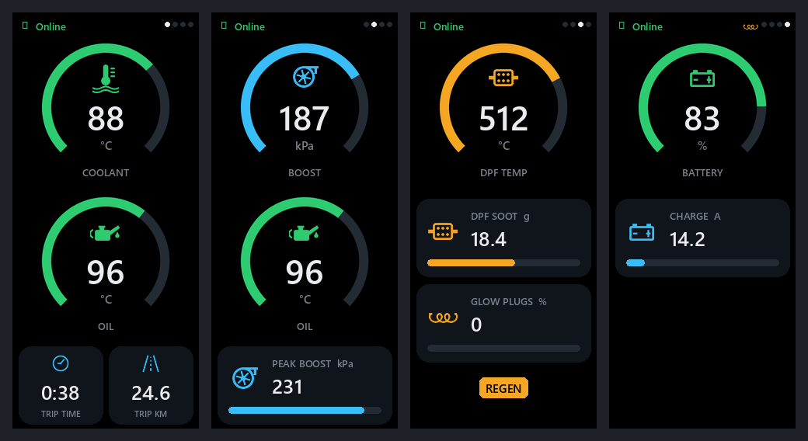

# Volvo P3 Car Dashboard

A custom car dashboard for **Volvo P3-platform 5-cylinder diesels** — S60/V60,
XC60, S80, V70/XC70 (roughly 2010–2014). An **ESP32-S3** with a small **AMOLED** display reads live engine
data from the car's OBD-II port over Bluetooth (through a cheap ELM327 adapter)
and renders a clean, portrait-mode LVGL dashboard — coolant/oil temperature,
turbo boost, DPF regeneration status, and battery/charging info.

It's built specifically around this engine's *enhanced* (manufacturer-specific)
PIDs — most notably it can detect and log **diesel particulate filter (DPF)
regeneration** events and keep lifetime statistics that survive power-off.

> ⚠️ **Engine-specific.** The standard PIDs (coolant, speed, RPM) will work on
> almost any OBD-II car, but the enhanced PIDs (oil temp, DPF temp/soot, glow
> plugs, battery charge current) were reverse-engineered from — and **verified
> on** — a Volvo **D5204T** (2.0 L, 163 hp, 5-cylinder diesel, ~2010–2014). They
> most likely also apply to the related 2.4 L 5-cylinder diesel (D5), but that is
> **untested**. On other engines/makes these values will very likely read
> garbage. See [Porting to another car](#porting-to-another-car).



## Screens

Navigate with a single button (the board's boot button on **GPIO0**, or the
touch "home" area on the panel):

| Gesture | Action |
|---|---|
| **Click** | Next screen (DRIVE → BOOST → DPF → POWER → …) |
| **Double-click** | Toggle the hidden **REGEN STATS** screen |
| **Long press** | Save stats and enter deep sleep (press again to wake) |

1. **DRIVE** — coolant + oil temperature arc gauges (blue = cold, green = OK,
   red = hot), trip time (engine runtime) and trip distance (integrated from
   vehicle speed).
2. **BOOST** — turbo boost pressure gauge, oil temperature gauge, and a
   peak-boost-this-trip tile.
3. **DPF** — DPF temperature gauge with a **REGEN** badge (lights at ≥ 450 °C),
   soot load tile, and a glow-plug indicator. The glow-plug coil icon also
   appears in the status bar of every screen while the plugs are on.
4. **POWER** — battery state-of-charge gauge and charge-current tile.
5. **REGEN STATS** *(hidden, double-click)* — DPF regeneration history: total
   count, km since the last regen, average km between regens, last duration, and
   grams of soot burned. Persisted in flash (NVS), so it survives power-off.

Gauge color thresholds (blue < 60 °C, red at coolant ≥ 100 °C / oil ≥ 110 °C,
etc.) are all tunable in [`src/config.h`](src/config.h).

## What you need (hardware)

| Part | Notes |
|---|---|
| **LilyGo T-Display AMOLED**, 1.91" | ESP32-S3, RM67162 AMOLED, 240 × 536 portrait. This is the target board — [product page](https://www.lilygo.cc/products/t-display-s3-amoled). |
| **BLE ELM327 OBD-II adapter** | A Bluetooth **Low Energy** ELM327 clone. This firmware looks for one advertising the BLE name **`IOS-Vlink`** (the common "vLinker"/"vgate iCar" style adapter). A different adapter name → change `ELM_DEVICE_NAME` in `config.h`. Classic-Bluetooth-only adapters will **not** work. |
| **A Volvo P3 5-cyl diesel** | S60/V60, XC60, S80, V70/XC70 with the 2.0 L D5204T (verified) — see the warning above. |
| **USB-C cable** | For flashing and power. In the car, power the board from a USB socket or a 12 V → USB adapter. |

No wiring or soldering is required — the display is on the board, and the OBD
data comes in wirelessly from the adapter plugged into the car's OBD-II port.

## Prerequisites (software)

- **[PlatformIO](https://platformio.org/)** — either the VS Code extension or the
  `pio` CLI (`pip install platformio`). All library dependencies (LilyGo AMOLED
  driver, OneButton, ELMDuino) are declared in `platformio.ini` and fetched
  automatically on the first build.
- **Python 3 + Pillow** — *only* if you want to regenerate the UI icons
  (`python3 tools/gen_icons.py`). Not needed for a normal build.

## Build & flash

From the project root:

```bash
pio run                      # compile
pio run -t upload            # compile + flash over USB
pio device monitor -b 115200 # serial log (OBD traffic, parse results, errors)
```

The PlatformIO environment is `T-Display-AMOLED` (custom board definition in
[`boards/lilygo-t-amoled.json`](boards/lilygo-t-amoled.json)).

<details>
<summary>Building from WSL against a Windows-side PlatformIO install</summary>

```bash
/mnt/c/Users/<you>/.platformio/penv/Scripts/pio.exe run -d "C:\path\to\car-dashboard-v2"
```
</details>

## First run

1. Plug the ELM327 adapter into the car's OBD-II port and turn the ignition on.
2. Power the board. It scans for the BLE adapter (`IOS-Vlink`), connects,
   initializes the ELM327, and starts polling. Connecting can take a few seconds;
   watch the serial monitor to see progress and any errors.
3. Once data flows, the gauges come alive. Only the PIDs needed by the current
   screen are polled at full rate, so switching screens is snappy.

## How it works

- **`src/obd/pid_defs.h`** — a single table of every PID: which ECU header to
  use (`7DF` standard, `7E0` engine, `726` central electronics), the request
  command, the expected echo, and the formula to convert the raw hex response to
  a real value + unit. Adding a PID is one table row.
- **`src/obd/ObdClient.*`** — the BLE/ELM327 state machine: round-robin polling,
  response parsing, and trip-distance integration from vehicle speed.
- **`src/obd/RegenTracker.*`** — DPF regeneration detection (sustained high DPF
  temperature) and the lifetime statistics stored in flash.
- **`src/ble/BLEClientSerial.*`** — a small `Stream` bridge over the adapter's
  BLE serial service, with a thread-safe ring buffer, auto-rescan, and
  disconnect detection.
- **`src/ui/ui_dashboard.*`** — hand-coded LVGL screens and reusable widget
  builders (arc gauges, tiles, stat rows). No SquareLine / drag-and-drop.
- **`src/ui/icons.*`** — generated anti-aliased icons (do not hand-edit;
  regenerate with `tools/gen_icons.py`).
- **`src/config.h`** — all tunables in one place: BLE name, poll intervals,
  gauge scales, color thresholds, regen-detection parameters.

`docs/volvo_pids.txt` contains the sniffed request/response pairs that this
firmware's PID formulas were derived from.

## Porting to another car

1. Sniff your car's OBD-II traffic (e.g. with the phone app for your adapter, or
   a generic OBD app) to capture the request/response pairs for the values you
   want. Standard OBD-II PIDs (`0105` coolant, `010C` RPM, `010D` speed, …) are
   the same on every car and are a safe starting point.
2. Add or edit rows in `src/obd/pid_defs.h` with the right header, command, echo,
   and formula.
3. Wire each value to a gauge or tile in `src/ui/ui_dashboard.cpp`.

The response-parsing pipeline is generic — the key detail (learned the hard way)
is that the adapter returns responses as **ASCII hex text**, so the code locates
the echo (`62<PID>` / `41<PID>`) and parses the hex *characters* after it rather
than indexing raw bytes.

## Disclaimer

This is a personal hobby project, provided as-is with no warranty. It only
**reads** data from the OBD-II port; it does not write to the car or clear
diagnostic codes. Don't operate the display in a way that distracts you while
driving, and use at your own risk.

## License

_No license file yet — add one (e.g. [MIT](https://choosealicense.com/licenses/mit/))
before sharing if you want others to be able to reuse the code._
